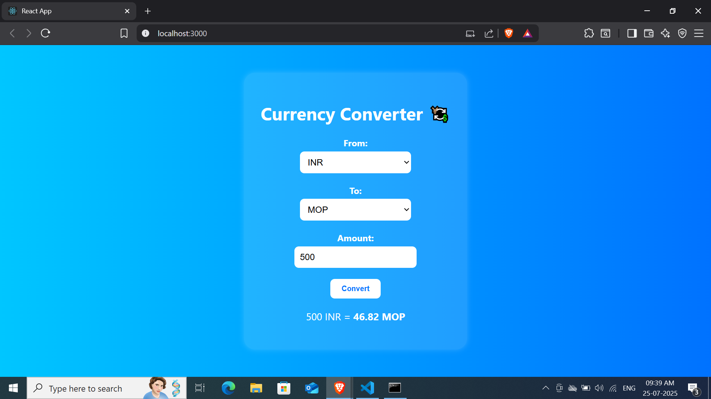
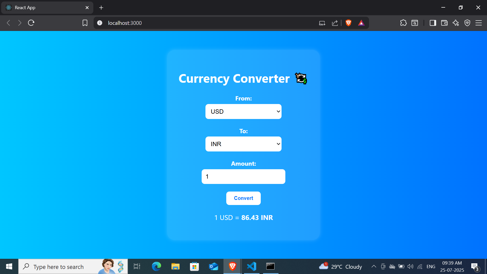

# 💱 Day 26: Currency Converter | #100DaysOfReact

A real-time currency converter built with React and Express.js using the ExchangeRate API. This project showcases seamless frontend-backend integration, responsive design, API data handling, and real-time user interaction.

---

## 🔗 Live Demo

🌐 [Live Currency Converter](https://react-currency-converter-frontend.onrender.com/)

---

## ✨ Features

- 🌍 Live exchange rates powered by [ExchangeRate API](https://www.exchangerate-api.com/)
- 🔽 Dropdowns to select From and To currencies
- 🔁 Instant conversion with API calls from backend
- 📱 Fully responsive design
- 🎯 Error handling for invalid input and API issues

---

## 🧠 Technologies Used

### Frontend:
- React
- Axios
- CSS Flexbox & Media Queries

### Backend:
- Express.js
- Node.js
- CORS
- Axios (for API requests)

---

## 📦 Installation & Run Locally

1. Clone the repository

git clone https://github.com/Gauravg2630/React-currency-converter.git
cd React-currency-converter

2. Start Backend:
cd backend
npm install
npm start

3. Start Frontend:
cd frontend
npm install
npm start
Make sure both servers are running concurrently.

🛠️ API Setup:
This project uses ExchangeRate API. Replace the API key in the backend file (server.js) with your own:
const apiKey = 'YOUR_API_KEY';

📷 Screenshots

📅 #100DaysOfReact Challenge
This is Day 26 of my #100DaysOfReact challenge where I build 100 real-world React projects in 100 days. Follow me to stay updated!

🤝 Connect
📌 LinkedIn : https://www.linkedin.com/in/gorav-gumber-9319a2342/

📌 GitHub : https://github.com/Gauravg2630
